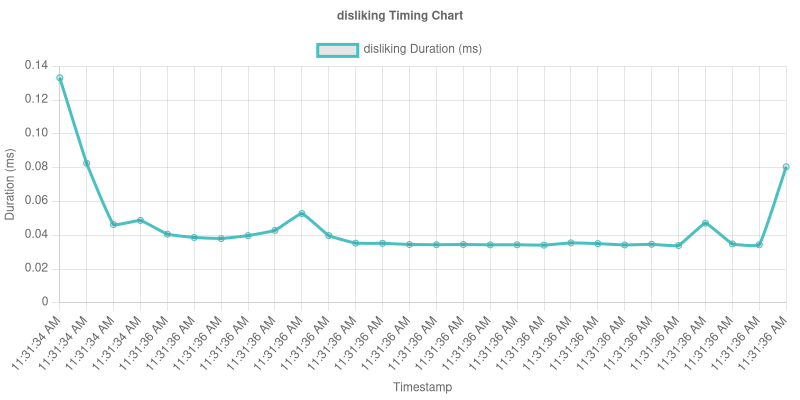

# LSS (Large Scale Simulations)

A Node.js application for running and analyzing large-scale social media simulations using LLM (Large Language Model) agents. This platform enables researchers and developers to study agent behaviors, interaction patterns, and emergent phenomena in controlled social media environments.

## 🚀 Features

- Run social media simulations with LLM agents
- Generate network (Barabasi)
- Visualize agent interactions and social graphs
- Perform sentiment analysis of posts and comments from top users
- Export data and visual insights

## 🛠️ Tech Stack

- **Backend:** Node.js
- **Language Models:** Integration with Together AI or other APIs
- **Visualization:** PNG/Graph-based outputs

## 📦 Installation

1. **Clone the repository**

   ```bash
   git clone https://github.com/abdulsittar/LSS.git
   cd LSS
   
   npm install
   Create a .env file with your configuration (e.g., API keys):
   TOGETHER_API_KEY=your_key_here
   TOPIC=topic_of_discussion_here
   POSTING_MODEL=posting_model_name_at_together_ai
   REPLYING_MODEL=replying_model_name_at_together_ai 

   USERS=No_of_users
   RANKER=your_ranker_here
   ITERATIONS=Number_of_steps_here
   
   npm start

## Equations

Time Utility (calculateTimeUtility):

U_time(t_spent, T_total) = - ( log( 1 + exp(t_spent - T_total) ) + 0.5 * penalty(t_spent, T_total) )


$$
\text{penalty}(t_{\text{spent}}, T_{\text{total}}) = 
\begin{cases} 
\log(1 + 0.5) & \text{if } t_{\text{spent}} > T_{\text{total}} \\
0 & \text{if } t_{\text{spent}} \leq T_{\text{total}}
\end{cases}
$$

Feedback Utility (calculateFeedbackUtility):

$$
U_{\text{feedback}}(F) =
\begin{cases}
\log(1 + F) & \text{if } F \geq 0 \\
-\log(1 - F) & \text{if } F < 0
\end{cases}
$$

Entertainment Utility (calculateEntertainmentUtility):
U_entertainment(entertainment_score) = 
    { log(1 + entertainment_score)  if  entertainment_score >= 0
    { -log(1 - entertainment_score) if  entertainment_score < 0


Total Utility (EUon) (calculateEUon):
$$
U_{\text{on}} = 0.4 \cdot U_{\text{time}}(t_{\text{spent}}, T_{\text{total}}) + 0.3 \cdot U_{\text{entertainment}}(E) + 0.3 \cdot U_{\text{feedback}}(F)
$$


Net Utility Difference (calculateNetUtilityDifference):
$$
\Delta U = U_{\text{on}} - U_{\text{off}} = U_{\text{on}} - 0
$$

Logon Probability (calculateLogonProbability):
$$
P_{\text{logon}} = \frac{1}{1 + \exp(-\text{sensitivity} \cdot \Delta U)}
$$


Time Budget (Ti):
Ti = 100 - 20 * (number of posts) - 20 * (number of comments) - 5 * (number of likes + dislikes)

Motivation (Mj):
Mj = initial motivation + 5 * (likes received) - 5 * (dislikes received)

$$
T_i = 100 - 20 \cdot N_{post}^{(i)} - 20 \cdot N_{comment}^{(i)} - 5 \cdot (N_{like}^{(i)} + N_{dislike}^{(i)})
$$


## 📊 Visual Outputs

### 📡 Network Graph

- **Overall Agent Interaction Network:**

  
  
  ---

### Cost Analysis Over Time





### Sentiment Analysis Over Time


