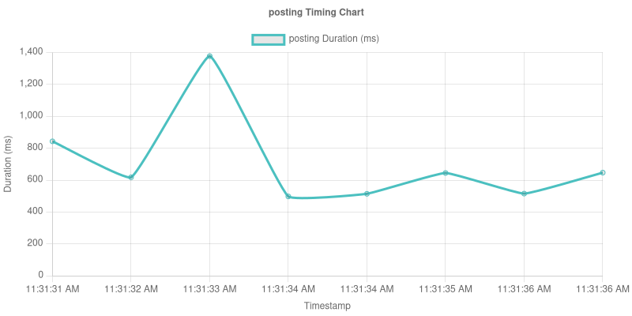
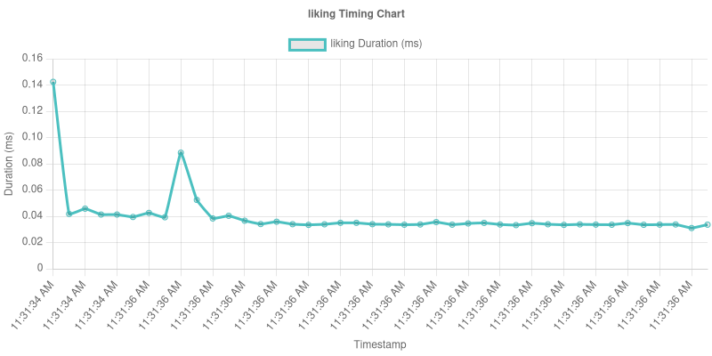
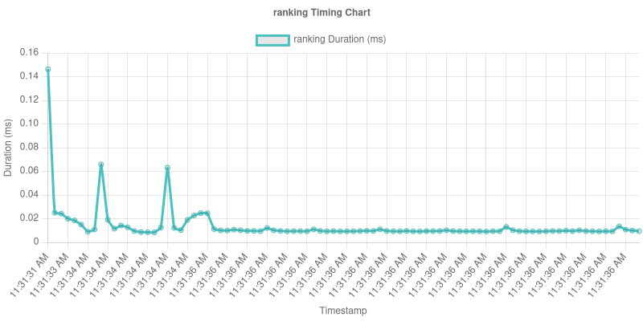

# LSS (Large Scale Simulations)

A Node.js application for running and analyzing large-scale social media simulations using LLM (Large Language Model) agents. This platform enables researchers and developers to study agent behaviors, interaction patterns, and emergent phenomena in controlled social media environments.

## 🚀 Features

- Run social media simulations with LLM agents
- Generate network (Barabasi)
- Visualize agent interactions and social graphs
- Perform sentiment analysis of posts and comments from top users
- Export data and visual insights

## 🛠️ Tech Stack

- **Backend:** Node.js
- **Language Models:** Integration with Together AI or other APIs
- **Visualization:** PNG/Graph-based outputs

## 📦 Installation

1. **Clone the repository**

   ```bash
   git clone https://github.com/abdulsittar/LSS.git
   cd LSS
   
   npm install
   Create a .env file with your configuration (e.g., API keys):
   TOGETHER_API_KEY=your_key_here
   npm start


## 📊 Visual Outputs

### 📡 Network Graph

- **Overall Agent Interaction Network:**

  
  
  ---

### 💰 Cost Analysis Over Time







### 💰 Sentiment Analysis Over Time


